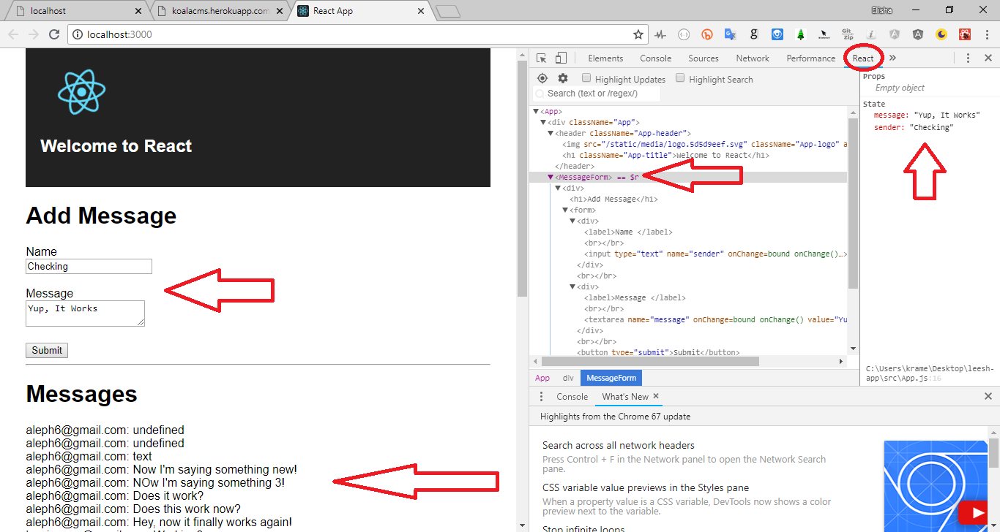
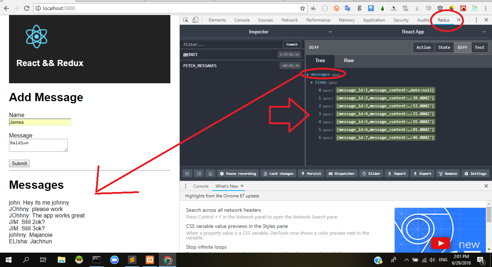
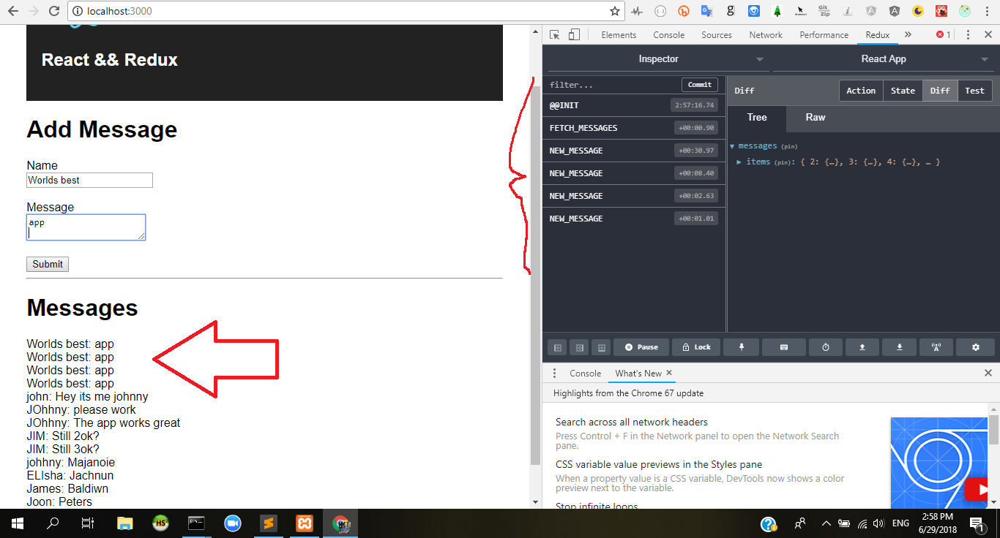
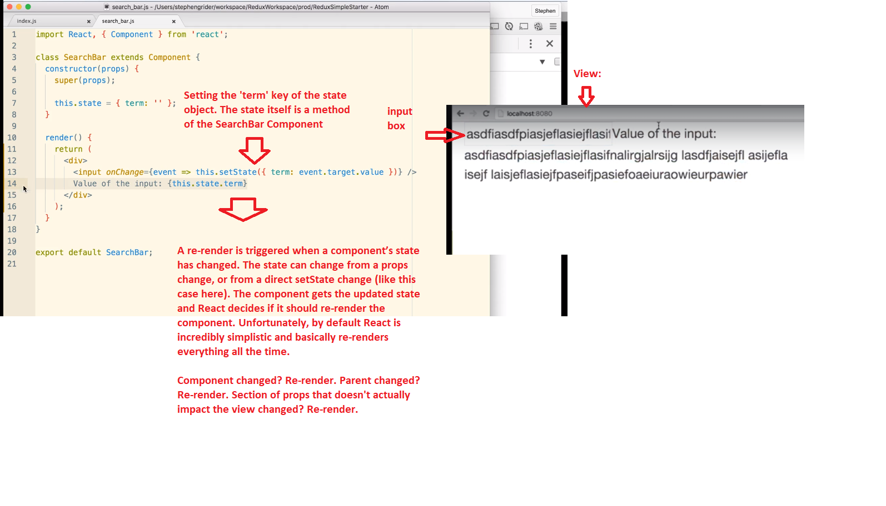
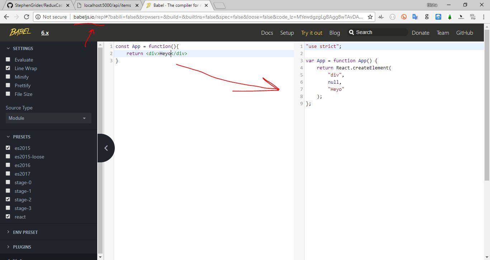

<h1>React Beginner's Guide</h1>

Dear friends,

This repo is based on repos that I have found online. In some cases I have added to the repo's code by adding a NodeJS server and MySQL database. In other cases, my innovation has been in documenting these projects - and how they are built using ReactJS, Redux, and Redux Devtools Chrome Extension.

All projects are located in separate folders within the root directory.

Table of Contents for this Repo:

- [Project #1: React, Redux, MySQL, NodeJS](#React-Redux-MySQL-NodeJS)
- [Project #2: React YouTube API](#React-YouTube-API)
- [License](#license)

React-Redux-MySQL-NodeJS
-------

Open 2 command prompts.

CMD #1: npm start // this will start React on Localhost:3000

CMD #2: node server // this will start the NodeJS Server on Localhost:5000

Prerequisites:

a) be sure you've created a new SQL Database with the file in the root directory called 'Database.sql'

b) Install the <a href="https://chrome.google.com/webstore/detail/redux-devtools/lmhkpmbekcpmknklioeibfkpmmfibljd?hl=en">Redux DevTools Chrome Extension</a>.

Up to 1:06:00 in the <a href="https://www.youtube.com/watch?v=93p3LxR9xfM">Traversy Tutorial on Redux</a>

Using this NodeJS API: http://koalacms.herokuapp.com/api/messages taken from another Repo I made about a <a href="https://github.com/ElishaKay/MySQL-Node-Angular">NodeJS CMS.</a>

The latest messages are immediately added to the state, which calls "MapStatetoProps[of the Component]" , and the Props of the Component pass it on to the DOM.

Form onSubmit event (vanillaJS-based) => Action => Reducer => Mapping State (of Application) to the Props of the Component => DOM Itself getting updated.

Tips for Deployment: Use <a href="https://stackoverflow.com/questions/46803442/concurrently-run-express-and-create-react-app-issue">Concurrently</a> or you'll have to deploy to two servers (one for Create React App and one for NodeJS API).

This project was bootstrapped with [Create React App](https://github.com/facebookincubator/create-react-app).

Below you will find some information on how to perform common tasks. 
You can find the most recent version of this guide [here](https://github.com/facebookincubator/create-react-app/blob/master/packages/react-scripts/template/README.md).

------------------------

Question: When is a component re-rendered?

Answer: A re-render can only be triggered if a component’s state has changed. The state can change from a props change, or from a direct setState change. The component gets the updated state and React decides if it should re-render the component. Unfortunately, by default React is incredibly simplistic and basically re-renders everything all the time.

Component changed? Re-render. Parent changed? Re-render. Section of props that doesn't actually impact the view changed? Re-render.

Source: http://lucybain.com/blog/2017/react-js-when-to-rerender/

___________________________________________________

<a href="http://babeljs.io/repl">Good resource for understanding how JSX is converted into a React.createElement function</a>

 

React-YouTube-API
-------

This repo is based on an excellent course from Udemy given by Stephen Grider: <a href=
"https://www.udemy.com/react-redux/">Modern React with Redux</a> - Master the fundamentals of React v16.3.2 and Redux as you develop apps with React Router, Webpack, and ES6. 

 

License
-------

The MIT License (MIT)

Copyright (c) 2018 Elisha Kramer

Permission is hereby granted, free of charge, to any person obtaining a copy of this software and associated documentation files (the "Software"), to deal in the Software without restriction, including without limitation the rights to use, copy, modify, merge, publish, distribute, sublicense, and/or sell copies of the Software, and to permit persons to whom the Software is furnished to do so, subject to the following conditions:

The above copyright notice and this permission notice shall be included in all copies or substantial portions of the Software.

THE SOFTWARE IS PROVIDED "AS IS", WITHOUT WARRANTY OF ANY KIND, EXPRESS OR IMPLIED, INCLUDING BUT NOT LIMITED TO THE WARRANTIES OF MERCHANTABILITY, FITNESS FOR A PARTICULAR PURPOSE AND NONINFRINGEMENT. IN NO EVENT SHALL THE AUTHORS OR COPYRIGHT HOLDERS BE LIABLE FOR ANY CLAIM, DAMAGES OR OTHER LIABILITY, WHETHER IN AN ACTION OF CONTRACT, TORT OR OTHERWISE, ARISING FROM, OUT OF OR IN CONNECTION WITH THE SOFTWARE OR THE USE OR OTHER DEALINGS IN THE SOFTWARE.

